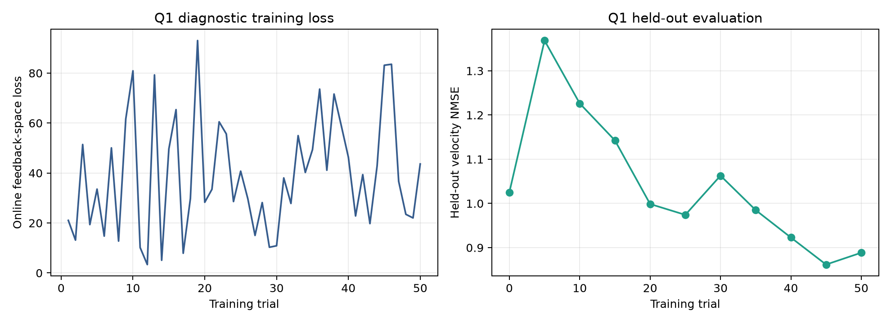
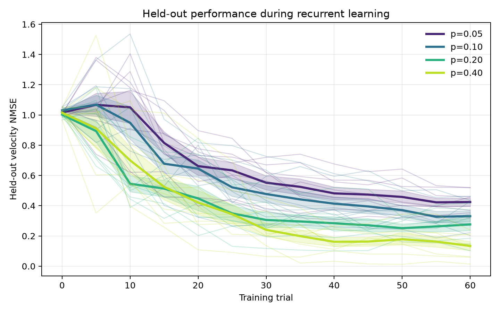

# NMA Motor-RNN Connectivity

A Neuromatch Academy project about how a recurrent network's wiring affects the way it learns to move.

## The question

We train a network to make reaching movements, then change how densely its neurons connect to each other. Denser networks learned better. But they also had more connections free to change, so we can't yet tell which of the two did the work.

> **When sparse and dense networks have the same number of trainable connections, does the gap get smaller?**

We're deciding whether to test that in [Issue #12](https://github.com/Thom-320/nma-motor-rnn-connectivity/issues/12).

## Q1 — can it learn at all?

Two panels, and the difference between them is the whole point.

On the left is the **online loss** the network uses while it learns. It jumps around and never really settles. That's expected — the target changes every trial, the network starts somewhere new each time, and the weights move mid-trial. It tells you almost nothing about whether the network learned.

On the right is the **held-out error**: fresh trials, learning switched off. That's the honest measure. It drops from about 1.0 to 0.87 over 50 trials. An NMSE of 1.0 means "no better than guessing the average", so this baseline barely gets off the ground — it's small ($N=100$) and sparse ($p=0.10$). It learns, but slowly.

If you only ever look at one of these two panels, look at the right one.

## Q2 — does density matter?

Same task, bigger network ($N=200$), four connection densities, eight seeds each. The faint lines are individual seeds; the thick ones are the averages.

Denser wins. The sparsest networks ($p=0.05$) flatten out around 0.42; the densest ($p=0.40$) get to 0.13. That held in **all eight seeds** — not a fluke of one lucky run.

What we hoped to see but didn't: a plateau. We expected the gains to level off once the network was dense enough. They didn't, in only 3 of 8 seeds. So we're not claiming it.

And the catch that drives the whole project: the denser networks also had **more connections free to change**. Density and trainable weights went up together, so this figure can't tell you which one earned the improvement.

## Start here

1. Open the notebook with the Colab badge above.
2. Leave `RUN_MODE = "view"` to look at the results without retraining. Use `smoke` if you want to check that everything runs.
3. Pick something up in [Issue #12](https://github.com/Thom-320/nma-motor-rnn-connectivity/issues/12).

How we ran things, and what the results don't show: [research overview](docs/RESEARCH_OVERVIEW.md). The papers: [literature review](docs/LITERATURE_REVIEW.md). Before changing anything: [CONTRIBUTING.md](CONTRIBUTING.md).
