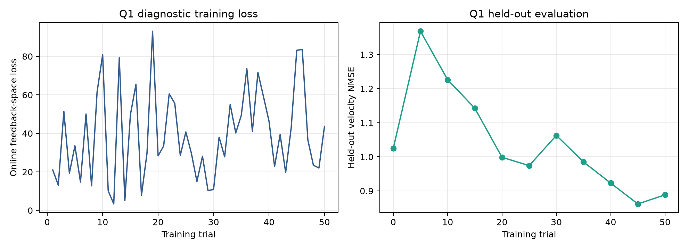
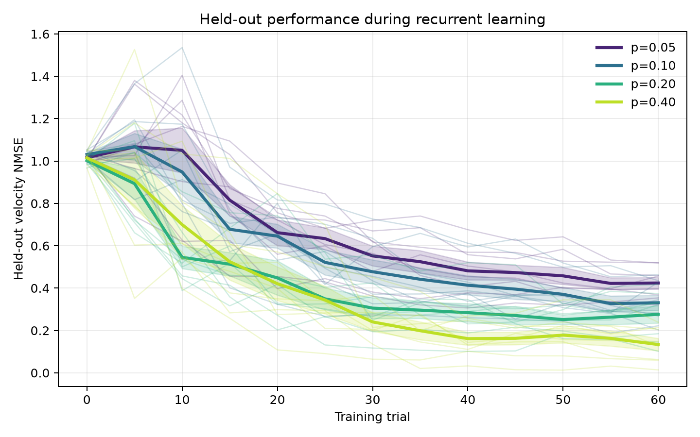

# NMA Motor-RNN Connectivity

[](https://github.com/Thom-320/nma-motor-rnn-connectivity/actions/workflows/tests.yml)
[](https://colab.research.google.com/github/Thom-320/nma-motor-rnn-connectivity/blob/main/notebooks/Motor_RNN_Project.ipynb)

A Neuromatch Academy project about how a recurrent network's wiring affects the way it learns to move.

**Context:** Computational Neuroscience team project, with a separate
equal-plasticity follow-up by Thomas Chisica. The model builds on the
Feulner/Clopath implementation and teaching fork credited in the
[research overview](docs/RESEARCH_OVERVIEW.md); this is not a new learning algorithm.

## Read in five minutes

- **Design:** four densities, eight paired network seeds and held-out evaluation with learning disabled.
- **Primary result:** denser, all-edges-plastic networks performed better in this experiment.
- **Control:** that trend did not recur with equal numbers of trainable recurrent edges. Read the [method and results](docs/EQUAL_PLASTICITY_CONTROL.md) before interpreting density as the cause.
- **Inspect without retraining:** open the notebook in `view` mode. The primary result and follow-up remain separate, and neither establishes a universal biological effect.

## The question

We train a network to make reaching movements, then change how densely its neurons connect to each other. Denser networks learned better. But they also had more connections free to change, so we can't yet tell which of the two did the work.

> **When sparse and dense networks have the same number of trainable connections, does the gap get smaller?**

The committed Q2 run does not separate density from the number of trainable
recurrent weights. A follow-up control for that confound is implemented in
[`run_equal_plasticity_experiment`](src/nma_motor_rnn/connectivity.py) and
described below; it is kept separate from the primary result until the team
reviews the analysis.

## Q1 — can it learn at all?



Two panels, and the difference between them is the whole point.

On the left is the **online loss** the network uses while it learns. It jumps around and never really settles. That's expected — the target changes every trial, the network starts somewhere new each time, and the weights move mid-trial. It tells you almost nothing about whether the network learned.

On the right is the **held-out error**: fresh trials, learning switched off. That's the honest measure. It drops from about 1.0 to 0.87 over 50 trials. An NMSE of 1.0 means "no better than guessing the average", so this baseline barely gets off the ground — it's small ($N=100$) and sparse ($p=0.10$). It learns, but slowly.

If you only ever look at one of these two panels, look at the right one.

## Q2 — does density matter?



Same task, bigger network ($N=200$), four connection densities, eight seeds each. The faint lines are individual seeds; the thick ones are the averages.

Denser wins. The sparsest networks ($p=0.05$) flatten out around 0.42; the densest ($p=0.40$) get to 0.13. That held in **all eight seeds** — not a fluke of one lucky run.

What we hoped to see but didn't establish: a plateau. The diminishing-returns contrast had the expected sign in only 3 of 8 seeds, and its interval included zero. We therefore do not claim a plateau.

And the catch that drives the whole project: the denser networks also had **more connections free to change**. Density and trainable weights went up together, so this figure can't tell you which one earned the improvement.

## Follow-up — equal plasticity control

We ran the same primary-sized experiment while giving every density the same
number of trainable recurrent edges. The denser networks still contain their
additional structural edges, but those edges are frozen during learning. In
this control, the mean final held-out NMSE was 0.424 at $p=0.05$, 0.524 at
$p=0.10$, 0.488 at $p=0.20$, and 0.530 at $p=0.40$ across eight seeds. The
primary all-edges-plastic trend therefore did not reappear under this control;
the result is descriptive and does not establish a universal causal effect of
density.

The full method, outputs and analysis boundary are in
[the equal-plasticity control note](docs/EQUAL_PLASTICITY_CONTROL.md). The
primary Q2 results above are unchanged.

## Start here

1. Open the notebook with the Colab badge above.
2. Leave `RUN_MODE = "view"` to look at the results without retraining. Use `smoke` if you want to check that everything runs.
3. Reproduce the equal-plasticity follow-up with
   `uv run python scripts/generate_equal_plasticity_control.py` after reviewing
   its analysis boundary in [the research overview](docs/RESEARCH_OVERVIEW.md).

How we ran things, and what the results don't show: [research overview](docs/RESEARCH_OVERVIEW.md). The papers: [literature review](docs/LITERATURE_REVIEW.md). Before changing anything: [CONTRIBUTING.md](CONTRIBUTING.md).

## Local checks

In an isolated environment, install the package and run the integrity tests:

```bash
python3 -m venv .venv
source .venv/bin/activate
python -m pip install -e '.[dev]'
python -m unittest discover -s tests -v
```

The [test code](tests/) covers implementation and stored-result consistency;
passing CI is not independent scientific replication. Rebuilding the full
experiments is a separate operation, not necessary to read the saved results.
