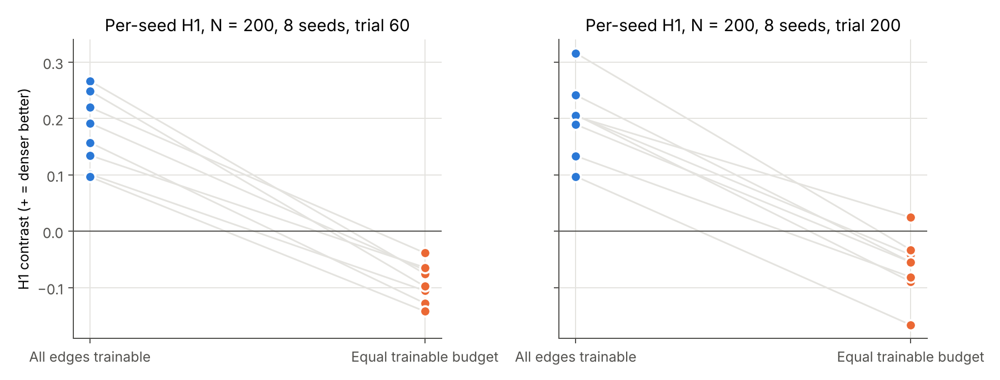
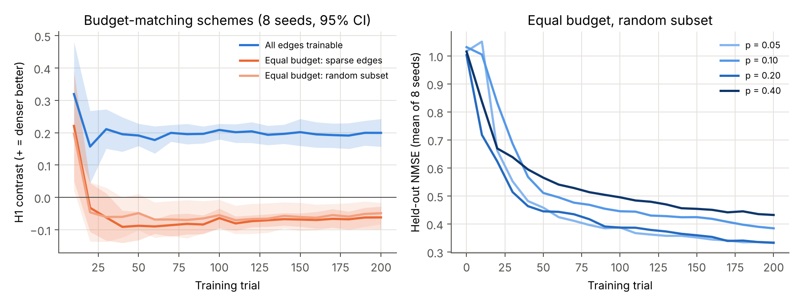
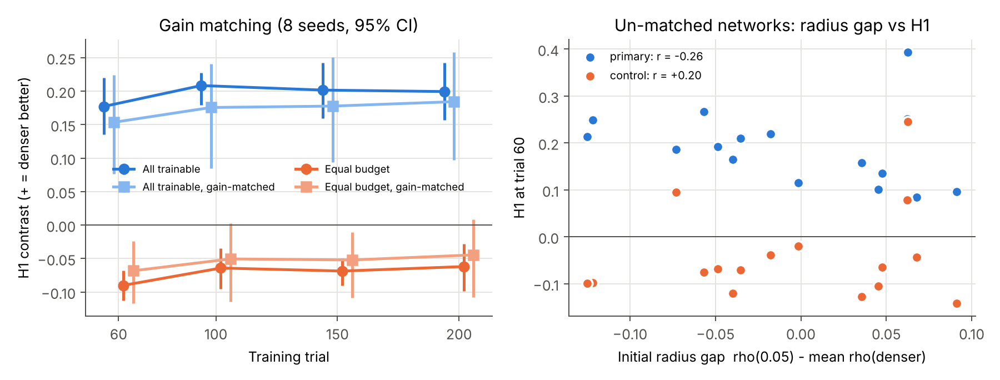
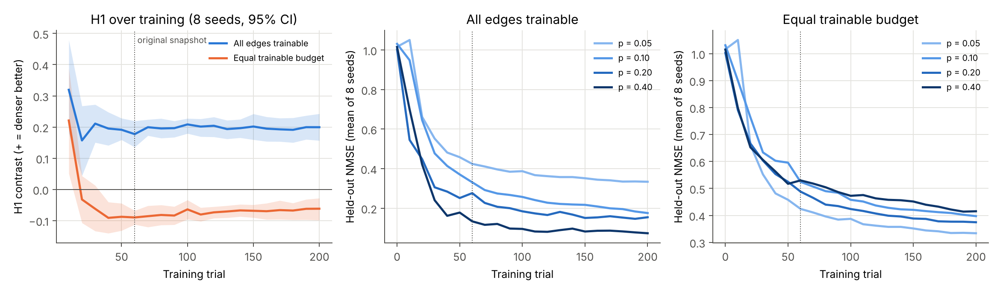
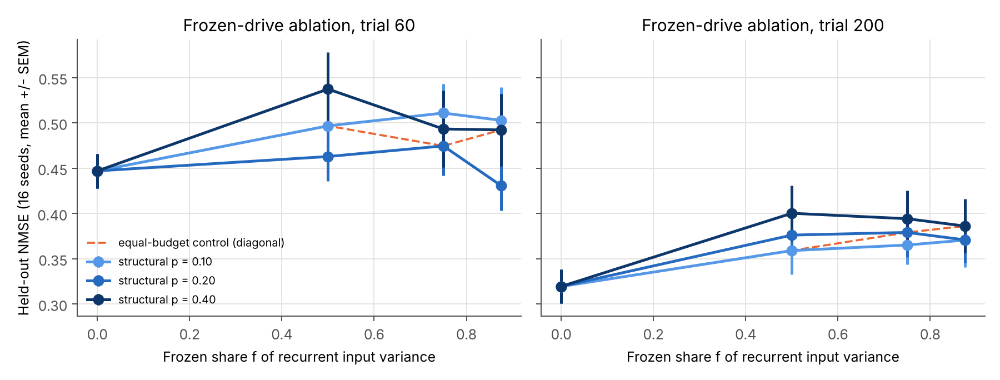
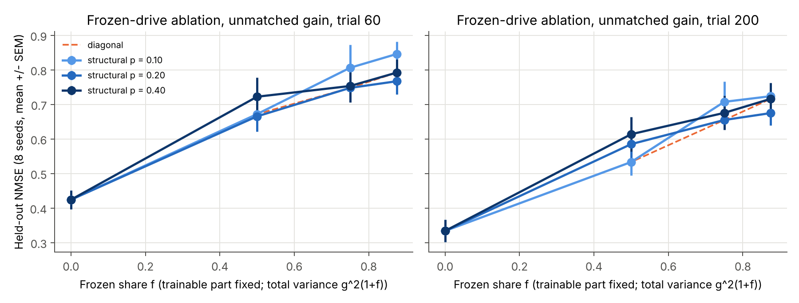
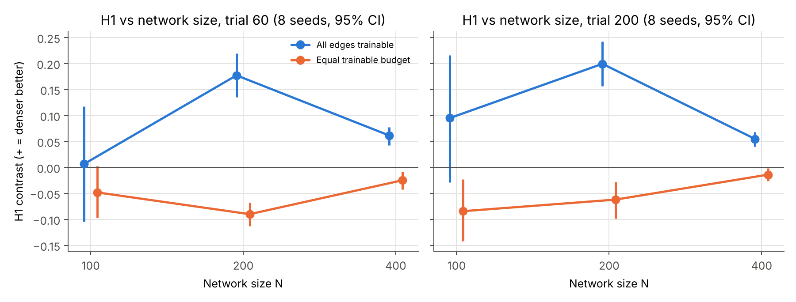

# The density advantage in FORCE-trained motor RNNs disappears under a matched plasticity budget

**Draft research note, target arXiv submission ~20 November 2026. Not peer reviewed.**

**Authors:** _[Author 1 — Thomas Chisica]_, _[Author 2]_, _[Author 3]_, _[Author 4]_
(Neuromatch Academy Computational Neuroscience 2026 project team; Thomas fills in
names, order, affiliations and contributions before submission.)

**Code and data:** <https://github.com/Thom-320/nma-motor-rnn-connectivity>,
branch `robustness-2026-10`. Every number below is regenerated by
`scripts/run_robustness_grid.py` and `scripts/analyze_robustness.py`.

---

## Abstract

We studied rate RNNs trained with FORCE-style recursive least squares (RLS) on
six-target centre-out reaching, following Feulner & Clopath (2021). Recurrent
connection density was varied over $p \in \{0.05, 0.10, 0.20, 0.40\}$, with
variance-scaled weights and paired seeds.

**All edges trainable.** Denser networks perform clearly better. The contrast
H1 (sparse NMSE minus mean denser NMSE) is +0.190 (seed-bootstrap 95 % CI
[0.154, 0.229]) and is positive in 16/16 network seeds at $N=200$.

**Equal trainable budget.** When every density receives the same number of
trainable edges, the advantage disappears. With the trainable set fixed to the
$p=0.05$ network's edges, the per-seed drop from the first condition to the
second is +0.231 [0.193, 0.267], positive in 16/16 seeds. It persists to 200
training trials, survives spectral-radius matching (+0.214 [0.184, 0.249],
16/16), also appears at $N=400$ (8/8 seeds) and, after 200 trials, at $N=100$.
It also appears when the budget is a random subset of each dense mask instead
(+0.248 [0.207, 0.285] at trial 200, 8/8).

**The reversal.** An earlier 8-seed analysis found the sign *reversed* under
the equal budget (H1 −0.090 [−0.113, −0.068]). That reversal is weaker than it
first looked:
- With 16 seeds it is −0.041 [−0.083, +0.011] at trial 60 and −0.055 [−0.100, −0.011] at trial 200.
- With spectral radii matched (16 seeds) it is not distinguishable from zero at either checkpoint (trial 200: −0.039 [−0.086, +0.004]).
- A factorial ablation (16 seeds) detects no density component in it. At a fixed share of frozen recurrent drive, the NMSE slope per doubling of density is +0.014 [−0.018, 0.047] at trial 200. Over the two doublings from $p=0.10$ to $0.40$ that interval still admits a density effect as large as the reversal, so density is not excluded. Adding frozen drive at a fixed density raises NMSE by 0.05–0.07 at trial 200, but this cost is not distinguishable from zero at trial 60.

**Conclusion.** In this model the density advantage tracks the number of
trainable recurrent edges, not structural density. Denser equal-budget
networks are not better, and they may be slightly worse; that small residual
tendency is not robust, and where it appears no density component is detected.
It is more consistent with a cost of the frozen recurrent input such a control
introduces, though neither explanation is established.

---

## 1. Introduction

Recurrent connectivity in cortex is sparse. Network models of motor learning
usually fix the connection probability: Feulner & Clopath (2021) use 10 %.
Sparse, variance-scaled random networks keep the overall recurrent input
statistics of dense ones, so one might expect density to matter little once the
weights are rescaled. With a learning rule that updates every existing edge,
though, density changes two things at once:
1. the structure of the recurrent graph;
2. the number of weights the rule can change, which scales as $pN^2$.

Our Neuromatch Academy project first observed that denser networks learned the
reaching task better when every existing edge was trainable. We then asked
whether this survives when the number of trainable edges is held fixed. The
first control suggested a clean sign reversal. This note reports the robustness
checks we ran before trusting that reversal, and what is left of it.

**Contribution.** A small, fully reproducible case study (paired seeds, held-out
evaluation with a fixed decoder, exact identity checks between arms) showing:
1. the density advantage in a FORCE-trained motor RNN is a plasticity-budget effect;
2. the apparent reversal under a matched budget is small and not robust to gain
   matching. A factorial ablation detects no density component in it; it is
   more consistent with a cost of the frozen edges that such a control
   necessarily introduces.

We make no claim about biological circuits.

## 2. Methods

### 2.1 Model and task

We use the rate RNN of Feulner & Clopath (2021) as adapted in the Neuromatch
Academy motor-RNN template.
- **Dynamics.** $N$ units with state $r$ and rate $z=\tanh(r)$ evolve as
  $\tau\dot r = -r + Wz + W_{\text{in}}u$, with $\tau=0.1$ s, Euler step
  $dt=0.01$ s and 2 s trials.
- **Task.** A 0.2 s one-hot cue $u$ selects one of six centre-out targets. The
  network must then produce a constant 2-D velocity (magnitude 0.2) through a
  fixed random linear decoder $D$ ($2\times N$, Frobenius norm 0.04).
- **Learning.** Recurrent weights are trained online with per-neuron RLS
  ($P_0=I/20$; an update every second time step after the cue). The decoder
  error is assigned to neurons through the pseudo-inverse $D^{+}$.
- **Fixed parts.** The decoder, the input weights and all RLS hyper-parameters
  never change.

**Connectivity.** Structural masks are nested: within a seed, edge $(i,j)$
exists at density $p$ iff $U_{ij}<p$, for one shared uniform matrix $U$ (no
self-connections). Non-zero weights are $W_{ij}=g\,G_{ij}/\sqrt{pN}$, with
$g=1.5$ and one shared Gaussian matrix $G$. All conditions of a seed share $U$,
$G$, $W_{\text{in}}$, $D$, the training target order and initial states, and
the held-out set. The densities are $p\in\{0.05,0.10,0.20,0.40\}$.

**Outcome.** Held-out velocity NMSE under the fixed decoder, with learning
switched off, on 30 trials (5 initial states × 6 targets). NMSE = 1 means
"no better than predicting the mean velocity". Lower is better.

**Training length.** Every network in this note is trained for 200 trials and
evaluated every 10 trials. The first 60 training trials and the held-out set are
drawn exactly as in the original 60-trial runs; trials 61–200 come from a
separate seeded stream. As a result, the trial-60 checkpoint of seeds 0–7
reproduces the original results to within 1.2 × 10⁻¹² (all 224 overlapping checkpoints). The original snapshot is
therefore a checkpoint of these runs, not a separate experiment.

### 2.2 Arms

| Arm | Trainable recurrent edges | Initial weights |
|---|---|---|
| All edges trainable (primary) | every existing edge (≈ $pN^2$) | $gG/\sqrt{pN}$ on $M_p$ |
| Equal trainable budget (control) | the $p=0.05$ edges $M_{0.05}$ in every density | as primary; edges in $M_p\setminus M_{0.05}$ are frozen |
| R2 gain-matched (both of the above) | as the parent arm | parent $W$ × scalar, so that $\rho(W_p)=\rho(W_{0.05})$ within the seed |
| Equal budget, random subset (B3) | a uniform random subset of $M_p$ of the same size as $M_{0.05}$ (separate random stream) | as primary; the other edges of $M_p$ are frozen |
| R3 frozen-drive factorial | $M_{0.05}$ | see §2.3 |
| R3 with unmatched total gain (B4) | $M_{0.05}$ | see §2.3 |

Because the masks are nested, the control's trainable *set* is identical
across densities, not just its size. The random-subset arm keeps only the size:
its trainable edges are spread over the dense mask, are not nested across
densities, and start from the smaller dense-network weights $gG/\sqrt{pN}$. At
$p=0.05$ both equal-budget arms are the primary network (verified identical).

### 2.3 R3: separating frozen drive from density

In the control, raising $p$ changes three things at once:
1. the number of frozen edges, which is density itself;
2. the share of recurrent input variance carried by frozen edges,
   $f_p=(p-0.05)/p$ = 0, 0.5, 0.75 or 0.875;
3. correspondingly, the size of the trainable weights.

To separate the first from the other two we build, for structural density $p$
and frozen share $f$,

$$W = \frac{g\sqrt{1-f}}{\sqrt{0.05N}}\,G\odot M_{0.05} \;+\; \frac{g\sqrt{f}}{\sqrt{(p-0.05)N}}\,G\odot(M_p\setminus M_{0.05}),$$

with only $M_{0.05}$ trainable. The expected total recurrent input variance
per unit is $g^2$ in every cell.

**Grid.** We run the full factorial $p\in\{0.10,0.20,0.40\}\times
f\in\{0.5,0.75,0.875\}$, plus $f=0$ (identical for every $p$).

**Two axes.**
- *Density at fixed $f$.* The trainable sub-network is bit-for-bit identical
  across $p$ and the frozen drive has the same variance. The only difference
  is how many frozen edges carry that variance.
- *Frozen share at fixed $p$.* The edge set is identical. The only difference
  is how much drive is frozen.

**Anchors.** The diagonal cells $(0.10,0.5)$, $(0.20,0.75)$ and $(0.40,0.875)$
are exactly the control networks, and $f=0$ is exactly the $p=0.05$ network.
All four reproduced the control's held-out NMSE exactly in every seed, so the
factorial is anchored to the control rather than being a new model.

**Avoiding a degenerate design.** The obvious alternative, deleting the frozen
edges, makes every network identical to $p=0.05$ and cannot measure anything.
Holding $g^2$ fixed also keeps "more frozen input" from being confounded with
"more total gain".

**Unmatched-gain variant (B4).** With $g^2$ fixed, more frozen drive also
means smaller trainable weights (factor $\sqrt{1-f}$). To separate the two we
also run the same 3 × 3 grid with the trainable weights left at the $p=0.05$
scale, $g/\sqrt{0.05N}$, and the frozen weights as above. The total input
variance is then $g^2(1+f)$; on the diagonal both edge sets keep their original
scales, and $f=0$ is again the $p=0.05$ network. This variant fixes the
trainable weights but trades the confound for another one: total gain (initial
spectral radius 1.9–2.2 against 1.56) grows with $f$.

### 2.4 Contrasts and statistics

**Contrasts.** Per seed:
- $H1=\text{NMSE}(0.05)-\tfrac13\sum_{p>0.05}\text{NMSE}(p)$. Positive means
  denser is better.
- $H2=[\text{NMSE}(0.05)-\text{NMSE}(0.20)]-[\text{NMSE}(0.20)-\text{NMSE}(0.40)]$.
  Positive means diminishing returns.
- The primary-minus-control change is the per-seed difference of the two arms'
  H1. It is possible because both arms share all seed-level randomness.
- For R3:
  - `density_f` = NMSE($p$=0.10, $f$) − mean NMSE($p$=0.20, 0.40; $f$);
  - `frozen_p` = NMSE($f$=0) − mean NMSE($p$; $f$ ≥ 0.5);
  - per-seed least-squares slopes of NMSE on $\log_2 p$ and on $f$ over the
    3 × 3 factorial.

**Inference.** The network seed is the replicate. We report:
- the mean;
- a seed-bootstrap 95 % percentile interval of the mean (100 000 resamples,
  fixed generator seed);
- the number of positive seeds;
- an exact two-sided sign test.

The smallest attainable sign-test $p$ is 0.0078 with 8 seeds and
3.1 × 10⁻⁵ with 16. No correction for multiple comparisons is applied; the
intervals are descriptive.

**Provenance.** H1 and H2 were first committed together with the primary
results (commit `3021081`, 14 Jul 2026), so they are *not* preregistered,
although early project documents called them "confirmatory". They were fixed
before the equal-budget control was run (`920ff92`, 29 Aug 2026). The
robustness checks R1–R5 were specified in writing before they were run
(9 Oct 2026), in response to an independent audit. We treat every contrast
as exploratory.

**Robustness checks.**
- **R1 (convergence):** 200 trials; checkpoints 60, 100, 150 and 200.
- **R2 (gain matching):** initial spectral radius matched to the $p=0.05$ network.
- **R3 (frozen drive vs density):** §2.3.
- **R4 (network size):** $N\in\{100,200,400\}$.
- **R5 (more seeds):** 16 seeds at $N=200$.
- **Second session (10 Oct 2026):** R2 and R3 extended to 16 seeds; B3, the
  random-subset equal budget (8 seeds); B4, the unmatched-gain R3 variant
  (8 seeds). These were listed as pending checks in the first session's record
  before they were run.

Unless stated otherwise, everything uses $N=200$; R2, R3 and R5 use 16 seeds
and the other checks seeds 0–7.

## 3. Results

### 3.1 With all edges trainable, denser is better, robustly

Mean held-out NMSE, $N=200$, 16 seeds:

| $p$ | All trainable, trial 60 | All trainable, trial 200 | Equal budget, trial 60 | Equal budget, trial 200 |
|---:|---:|---:|---:|---:|
| 0.05 | 0.447 | 0.320 | 0.447 | 0.320 |
| 0.10 | 0.359 | 0.207 | 0.497 | 0.359 |
| 0.20 | 0.271 | 0.155 | 0.475 | 0.379 |
| 0.40 | 0.141 | 0.077 | 0.492 | 0.386 |

With all edges trainable, H1 is positive at every checkpoint and in every
variant at $N=200$, and in every seed except one gain-matched seed:
- 16 seeds, trial 60: +0.190 [0.154, 0.229];
- 16 seeds, trial 200: +0.173 [0.135, 0.210];
- gain-matched, 16 seeds, trial 200: +0.175 [0.128, 0.218], positive in 15/16.

H2 (diminishing returns) is not supported at the original snapshot: +0.046
[−0.018, 0.111], 9/16. At trial 200 it is weakly positive (+0.087
[0.004, 0.170], 9/16), so we do not treat it as established.

### 3.2 Under an equal budget the advantage disappears



The paired primary-minus-control change in H1 is the most robust number in
this study. It is positive in every seed of every check that ran:

| Check | Paired change in H1 (primary − control) |
|---|---|
| Original snapshot, 8 seeds, trial 60 | +0.267 [0.232, 0.304], 8/8 |
| R1, trial 200 | +0.261 [0.228, 0.296], 8/8 |
| R2 gain-matched, 16 seeds, trial 60 | +0.205 [0.169, 0.242], 16/16 |
| R2 gain-matched, 16 seeds, trial 200 | +0.214 [0.184, 0.249], 16/16 |
| B3 random-subset budget, trial 60 | +0.246 [0.170, 0.317], 8/8 |
| B3 random-subset budget, trial 200 | +0.248 [0.207, 0.285], 8/8 |
| R5, 16 seeds, trial 60 | +0.231 [0.193, 0.267], 16/16, $p=3\times10^{-5}$ |
| R5, 16 seeds, trial 200 | +0.229 [0.191, 0.265], 16/16 |
| R4, $N=100$, trial 200 | +0.179 [0.096, 0.273], 8/8 |
| R4, $N=400$, trial 200 | +0.069 [0.060, 0.079], 8/8 |

The denser networks' advantage therefore depends on their extra trainable
edges. Holding the number of trainable edges fixed removes all of it, whether
the trainable edges are the sparse network's edges or a random subset of the
dense mask.



### 3.3 The sign reversal is small and fragile

The equal-budget H1 in each check (negative = sparse better):

| Check | Equal-budget H1 | Negative seeds |
|---|---|---|
| Original 8 seeds, trial 60 | −0.090 [−0.113, −0.068] | 8/8 |
| R1, trial 100 / 150 / 200 | −0.064 / −0.069 / −0.062, all CIs < 0 | 7/8, 8/8, 7/8 |
| R2 gain-matched, 8 seeds, trial 60 / 200 | −0.068 [−0.117, −0.024] / −0.045 [−0.108, +0.009] | 8/8, 5/8 |
| R2 gain-matched, 16 seeds, trial 60 | −0.027 [−0.073, +0.019] | 10/16 |
| R2 gain-matched, 16 seeds, trial 200 | −0.039 [−0.086, +0.004] | 9/16 |
| B3 random-subset budget, trial 60 | −0.069 [−0.125, −0.015] | 6/8 |
| B3 random-subset budget, trial 200 | −0.049 [−0.083, −0.017] | 6/8 |
| R5 16 seeds, trial 60 | −0.041 [−0.083, +0.011] | 13/16 |
| R5 16 seeds, trial 200 | −0.055 [−0.100, −0.011] | 12/16 |
| R4 $N=100$, trial 200 | −0.084 [−0.142, −0.023] | 6/8 |
| R4 $N=400$, trial 200 | −0.014 [−0.027, −0.002] | 6/8 |

The point estimate is negative in every check, but the effect is small and
fragile. Its magnitude roughly halves when the seed count doubles: seeds 8–15
alone average +0.008 at trial 60 (−0.049 at trial 200), so the original 8-seed
estimate was optimistic. Under gain matching with 16 seeds the interval
includes zero at both checkpoints, and only 9–10 of 16 seeds are negative. The
random-subset budget (B3) gives a negative H1 at 8 seeds, but so did the
original control at 8 seeds before it halved.

"Denser is worse under an equal budget" is therefore at most a modest
tendency, not a clean reversal. We do not claim it.

**Spectral radius.** The initial spectral radius was not controlled in the
original runs (1.48–1.65). In seeds 0–7 the sparse-minus-denser radius gap
correlated with primary H1 at $r=-0.90$. Over 16 seeds this falls to
$r=-0.26$ (primary) and $r=+0.20$ (control). Matching the radii (R2) leaves
both the primary advantage and the paired change intact. The strong
correlation was a small-sample coincidence, not a mechanism.



### 3.4 Convergence



The original trial-60 snapshot was taken mid-learning: 23/32 primary networks
were still improving between trials 50 and 60. Training to 200 trials lowers
every NMSE substantially, but every contrast stays within its trial-60
interval:
- primary H1: +0.177 → +0.199 [0.157, 0.243];
- control H1: −0.090 → −0.062 [−0.099, −0.028];
- paired change: +0.267 → +0.261.

The networks are still not fully converged at 200 trials. Between trials 150
and 200, 23/32 primary and 26/32 control networks improved (median relative
NMSE change −11 % and −7 %). Between trials 190 and 200 only about half
improved (17/32 and 15/32), which is consistent with a plateau plus noise. H1
was flat from trial 40 onward in both arms.

### 3.5 No density component is detected in the control's residual tendency



**Density at a fixed frozen share has no detectable effect** (R3, 16 seeds).

| R3 contrast (16 seeds) | Trial 60 | Trial 200 |
|---|---|---|
| density, $f=0.5$ | −0.003 [−0.069, 0.062] | −0.029 [−0.093, 0.042] |
| density, $f=0.75$ | +0.027 [−0.049, 0.104] | −0.021 [−0.077, 0.034] |
| density, $f=0.875$ | +0.041 [−0.038, 0.121] | −0.008 [−0.078, 0.065] |
| slope per doubling of $p$ | +0.002 [−0.037, 0.043] | +0.014 [−0.018, 0.047] |

All intervals include zero and are centred near it; the 16-seed slope
intervals are about half as wide as the 8-seed ones. This is the most solid
part of the R3 result, but it is an absence of evidence, not evidence of
absence. The trial-200 density contrasts reach −0.08 to −0.09, and the slope's
upper bound (+0.047 per doubling, two doublings from $p=0.10$ to $0.40$) allows
up to ≈ 0.09 NMSE. Both exceed the control's reversal (−0.055), so a density
component of that size cannot be excluded. Excluding it would need intervals of
about ±0.03, i.e. roughly four times as many seeds.

**Adding frozen drive at a fixed density: a small cost, clear only at trial 200.**

| $f=0$ minus mean over $f\ge0.5$ (16 seeds) | Trial 60 | Trial 200 |
|---|---|---|
| $p=0.10$ | −0.056 [−0.116, 0.003], 6/16 + | −0.045 [−0.092, 0.001], 6/16 + |
| $p=0.20$ | −0.009 [−0.067, 0.052], 7/16 + | −0.056 [−0.110, −0.001], 5/16 + |
| $p=0.40$ | −0.061 [−0.124, 0.007], 4/16 + | −0.074 [−0.129, −0.022], 4/16 + |

With 8 seeds two of these three intervals excluded zero at trial 60; with 16
seeds none does, and the per-seed sign tests are not significant ($p \ge 0.077$).
At trial 200 the mean NMSE rises from 0.320 ($f=0$) to 0.36–0.40 for every cell
with $f\ge0.5$, and the slope over $f\in[0.5,0.875]$ is flat (−0.005
[−0.058, 0.043]).

**What the unmatched-gain variant adds (B4, 8 seeds).** Keeping the trainable
weights at full size and adding frozen drive on top is far worse: NMSE 0.53–0.72
at trial 200 against 0.334 at $f=0$ (frozen-drive cost −0.30 to −0.34, 8/8
seeds in every column), and the cost now grows with $f$ (slope +0.350
[0.273, 0.426] per unit $f$, 8/8). Every unmatched cell is worse than the
matching gain-matched R3 cell (mean difference −0.260 [−0.300, −0.222], 8/8).
So shrinking the trainable weights is not what makes R3's frozen-drive cells
worse: at the same frozen drive, full-size trainable weights do worse, not
better. Because the unmatched networks also have larger total gain, B4 cannot
say whether frozen drive as such or the extra gain does the damage; density
again has no effect at fixed $f$ (slope +0.007 [−0.024, 0.037]).



**Interpretation.** The equal-budget control, rebuilt from the factorial's
diagonal, compares a network with no frozen drive ($p=0.05$) against three
networks that have some. Density at fixed frozen share contributes nothing
detectable, although the ablation is not precise enough to exclude a density
component as large as the control's residual negative H1. Attributing it to frozen recurrent drive is consistent with the R3
step at trial 200 and with B4, but the 16-seed evidence for that step is weak
(trial 200 only, sign tests not significant), so we state it as the most
likely explanation rather than as an established result.

### 3.6 Network size



**$N=100$.** Learning is poor: NMSE 0.60–0.79 at trial 200 and 0.75–0.85 at
trial 60, against a chance level of 1. The primary H1 does not differ from
zero (trial 60: +0.007 [−0.104, 0.118]; trial 200: +0.095 [−0.029, 0.216]).
This matches the earlier 3-seed $N=100$ pilot, which had the opposite sign and
which we now read as a regime in which too little is learned for density to
matter. The control H1 is negative at trial 200 (−0.084 [−0.142, −0.023]).
The paired change is +0.179 [0.096, 0.273], 8/8.

**$N=400$.** Learning is much better (trial-200 NMSE 0.012–0.080 with all
edges trainable), so every contrast is smaller in absolute NMSE units. The
pattern of $N=200$ is reproduced at both checkpoints:
- primary H1: +0.062 [0.043, 0.077] at trial 60 and +0.055 [0.040, 0.068] at
  trial 200, 8/8 positive;
- equal-budget H1: −0.025 [−0.042, −0.008] and −0.014 [−0.027, −0.002],
  6/8 negative;
- paired change: +0.086 [0.077, 0.097] and +0.069 [0.060, 0.079], 8/8.

In relative terms the effect is large. With all edges trainable, $p=0.40$
reaches 15 % of the $p=0.05$ NMSE (0.012 vs 0.080). Under the equal budget,
$p=0.05$ is still the best condition (0.080 vs 0.084–0.103).

**Across sizes.** The sign pattern holds wherever the networks learn.
Absolute H1 is not comparable across $N$, because the NMSE floor differs.

## 4. Limitations

- **One model family and one task.** Rate units with tanh, FORCE/RLS on
  recurrent weights, a fixed random decoder, and six-target reaching with
  constant velocities. We do not test other learning rules (BPTT,
  node-perturbation), output training, or structured connectivity.
- **Small samples.** 16 seeds for R2, R3 and R5; 8 seeds for R1, R4, B3 and
  B4. R5 and R2 show that 8-seed effect sizes in this system can shrink by
  half; the $N=400$, random-subset and unmatched-gain results rest on 8 seeds.
- **Not fully converged.** At 200 trials, roughly half of the networks still
  improve over the last 10 trials. Contrasts were stable from trial ~40 onward,
  but asymptotic behaviour is not established.
- **Budget-matching schemes.** We tested two: the sparse network's edges and
  a random subset of each dense mask (8 seeds). Both remove the advantage.
  Other schemes, such as an equal number of trainable weights per neuron, were
  not tested.
- **Frozen drive vs gain.** R3 holds total variance at $g^2$, so more frozen
  drive also means smaller trainable weights; B4 keeps the trainable weights
  fixed but lets total gain grow. Together they rule out "smaller trainable
  weights" as the source of R3's cost, but they do not separate frozen drive
  from total gain. The missing cell is shrunken trainable weights with the
  frozen edges deleted.
- **Gain matching rescales all weights.** It matches the spectral radius but
  changes the trainable weights' scale too.
- **Analysis choices.** H1/H2 are exploratory, not preregistered (§2.4). No
  multiplicity correction is applied across the ~60 reported intervals.
- **Biology.** No claim about cortical connectivity follows from this model.

## 5. Conclusion

In a FORCE-trained motor RNN, the performance advantage of denser recurrent
connectivity is explained by the number of trainable recurrent edges:
- holding the trainable set fixed removes it in 16/16 seeds;
- this holds across training length, spectral-radius matching (16/16) and a
  second budget-matching scheme (random subset, 8/8);
- it holds at $N=400$, and at $N=100$ after 200 trials. At $N=100$ the
  networks barely learn, and the all-trainable advantage itself is not
  significant there.

Under a matched budget, denser networks are no better and possibly slightly
worse. That residual handicap is small and does not survive gain matching with
16 seeds. A factorial ablation detects no density component in it, but cannot exclude
one of the same size. It is most plausibly a cost of the frozen recurrent drive
the control introduces, but that attribution also rests on weak evidence.

Studies that vary connectivity under recurrent learning should report the
trainable-parameter count as a separate factor. They should also note that
"freezing the extra edges" is not a neutral control.

## References

- Feulner, B. & Clopath, C. (2021). Neural manifold under plasticity in a goal
  driven learning behaviour. *PLOS Comput. Biol.* 17(2): e1008621.
  doi:10.1371/journal.pcbi.1008621
- Sussillo, D. & Abbott, L. F. (2009). Generating coherent patterns of activity
  from chaotic neural networks. *Neuron* 63(4): 544–557.
- Jaeger, H. & Haas, H. (2004). Harnessing nonlinearity: predicting chaotic
  systems and saving energy in wireless communication. *Science* 304: 78–80.

_(Thomas: check the full reference list against `literature/references.bib`
before submission.)_

## Reproducibility

```bash
pip install -e .
python scripts/run_robustness_grid.py --workers 4     # R1-R5, ~2 h on 4 CPU cores; resumable
python scripts/run_robustness_grid.py --only R2x,R3x,B3,B4   # second session, ~52 min
python scripts/analyze_robustness.py                  # tables + figures
python -m unittest discover -s tests                  # 40 tests
```

Per-network CSVs are in `results/robustness/raw/`, merged tables in
`results/robustness/<arm>_N<N>/`, and contrasts in
`results/robustness/analysis/`. A record of the compute session is in
[`docs/CLOUD-SESSION-2026-10.md`](../docs/CLOUD-SESSION-2026-10.md).
